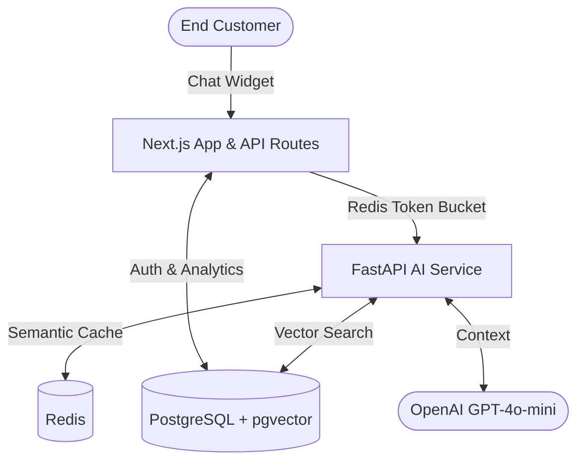

# Deflekt

> **"Answer the tickets you shouldn't have to."**

Deflekt is a multi-tenant SaaS application that connects to a business's help center and answers repetitive customer questions with cited, grounded replies. If the system's confidence falls below a set threshold, it gracefully hands off to a human.

## System Architecture

## Key Architectural Decisions
See `DECISIONS.md` for the full architecture decision records (ADRs). Key choices include:
- **pgvector**: We use a single PostgreSQL instance for both relational data (tenants, users, conversations) and vector embeddings (`chunks`). This simplifies operations and ensures strict tenant isolation via foreign keys and row-level filtering.
- **Semantic Caching**: To reduce LLM costs and latency, the FastAPI service caches answers in Redis, keyed by the question's embedding similarity. The cache is scoped per tenant and invalidated when documents are re-ingested.
- **Confidence Gate**: A strict threshold-based confidence gate ensures that "I don't know" is treated as a feature. Answers that aren't grounded in the retrieved context are marked as escalations rather than emitting hallucinations.

## Running Locally

Requirements: Docker, Docker Compose, Node.js v20.

1. Clone the repository.
2. Copy `.env.example` to `app/.env` and `ai-service/.env`, and populate your `OPENAI_API_KEY`.
3. Run `docker-compose up --build` to spin up the database, Redis, Next.js, and FastAPI.
4. Go to `http://localhost:3000` to access the dashboard.
5. In another terminal, run `npm run db:migrate` in the `app` directory to initialize the tables.

## Production Deployment

This repository is configured for automated CI/CD to AWS EC2 using GitHub Actions and GitHub Container Registry (GHCR).

The `docker-compose.prod.yml` spins up:
- Next.js App
- FastAPI AI Service
- Redis
- NGINX Reverse Proxy

The database is managed via AWS RDS (PostgreSQL). For step-by-step AWS provisioning instructions, refer to the `aws_setup_guide.md`.

## Automated Evaluations (CI Gate)

Deflekt employs Eval-Driven Development. A golden set of question/answer pairs is defined in `ai-service/evals/run.py`. Every PR triggers this harness to verify:
- **Recall@3**: Does the right document chunk get retrieved?
- **Faithfulness**: Is the LLM's answer fully entailed by the retrieved chunks? (LLM-as-judge)
- **Citation Accuracy**: Do the provided citation indices match the retrieved context?

If faithfulness drops below 80%, the CI pipeline fails.
